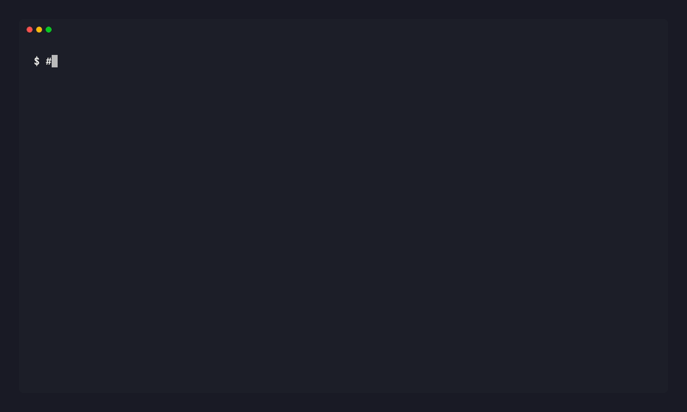

# Veil

[](https://github.com/8enji/veil/actions/workflows/ci.yml)
[](https://pkg.go.dev/github.com/8enji/veil)

[](LICENSE)


**.gitignore protected your secrets from git. Veil protects them from AI.**

Veil is a local CLI that sits between your AI coding agents and the network via a local HTTPS proxy. It replaces real secrets with format-aware placeholders, then injects the real credentials at the proxy layer — so the agent never sees them. Works with any agent or tool that respects `HTTP_PROXY` / `HTTPS_PROXY` environment variables, including Claude Code, Cursor, curl, and most HTTP clients.

## Demo



> Want to run it yourself? `make build && ./scripts/record-demo.sh` records this end-to-end against a synthetic `.env`.

## Why this exists

Your AI agent can read every secret in your project — every `.env`, every MCP config, every key it stumbles across in your code. `.gitignore` stopped this at the git boundary years ago. Nothing has stopped it at the AI boundary. Veil is that gap-filler.

## How it works

1. `veil init` scans your `.env` files and MCP configs, moves secrets into your OS keychain, and drops in placeholders that look real (correct prefix, length, charset).
2. `veil run <agent>` starts a local HTTPS proxy and launches your agent with `HTTP_PROXY` / `HTTPS_PROXY` set. The proxy swaps placeholders for real credentials on outbound requests.
3. Every credential injection and agent action is logged to local SQLite. Query with `veil log`.

The agent thinks it has real tokens. It doesn't.

## Install

```
go install github.com/8enji/veil/cmd/veil@latest
```

Or build from source:

```
git clone https://github.com/8enji/veil.git
cd veil
make build
# binary at bin/veil
```

Pre-built binaries land with the v0.1.0 release.

## Usage

```bash
# Initialize — migrate secrets to keychain, drop in placeholders
veil init

# Run an agent through the proxy
veil run claude
veil run cursor

# Check what's managed
veil status
veil list

# Add a secret manually
veil add GITHUB_TOKEN --value ghp_abc123

# View audit logs
veil log
veil log --since 1h

# Reverse it — restore original .env/MCP files, wipe vault and state
veil uninstall              # prompts with diff before touching anything
veil uninstall --dry-run    # preview the plan without changes
```

## What it supports

- **Secrets**: AWS, Stripe, GitHub PATs, OpenAI, Slack, Twilio, SendGrid, Supabase, and more — with format-aware placeholders for each
- **Keychain**: macOS Keychain, Linux Secret Service (with age-encrypted file fallback)
- **Agents**: anything that respects `HTTP_PROXY` / `HTTPS_PROXY`
- **MCP configs**: auto-detects and migrates plaintext tokens from MCP configuration files

## How Veil compares

Veil isn't a replacement for a secrets manager — it sits beside one. Secrets managers inject credentials **into your application**. Veil hides them **from the AI agent you're using to write that application**.

| | Stores secrets | Scans for leaks | Hides from running agent | Local-first | Free |
|---|:---:|:---:|:---:|:---:|:---:|
| Doppler | ✓ | — | — | — | freemium |
| Infisical | ✓ | partial | — | self-host | ✓ |
| gitleaks | — | ✓ | — | ✓ | ✓ |
| **Veil** | OS keychain | — | **✓** | ✓ | ✓ |

## FAQ

**How is this different from Doppler / Infisical / 1Password CLI?**
They inject secrets *into your app at runtime*. Veil hides secrets *from the agent that's writing your app*. They're complementary: use both. The threat models differ — secrets managers protect against credentials leaking through your application's logs and configs; Veil protects against credentials leaking through an AI agent's context window, tool calls, or training data.

**Does the AI agent need to know about Veil?**
No. That's the design. Any HTTP client that respects `HTTP_PROXY` / `HTTPS_PROXY` works unchanged — Claude Code, Cursor, `curl`, language SDKs that use the standard env-var conventions. The agent sees placeholders and routes outbound calls through Veil; Veil substitutes the real credentials at the network boundary.

**Veil MITMs TLS. Is that safe?**
Yes, with caveats. Veil installs a CA cert in your **user-scoped** trust store (not system-wide) and only uses it for the proxy on `localhost`. The CA's private key is generated locally and never leaves your machine. See [docs/THREAT_MODEL.md](docs/THREAT_MODEL.md) for the full assumptions.

**What if a malicious agent ignores `HTTP_PROXY`?**
Then Veil doesn't protect you. Veil is not a sandbox. It assumes a *cooperative-but-curious* agent — one that follows standard HTTP conventions but might leak secrets it has seen. If you're worried about a hostile agent with arbitrary code execution, you need OS-level isolation, not a proxy.

**Does it work with non-HTTP protocols (WebSockets, gRPC)?**
HTTPS-over-CONNECT and plain HTTP today. WebSockets that upgrade through the proxy traverse it but Veil does not inject into the WS frame body. gRPC over HTTP/2 is on the roadmap. If you need this, [open an issue](https://github.com/8enji/veil/issues/new).

**Is this production-ready?**
No. Pre-1.0. Designed for **dev-machine** use with AI coding agents. Veil is not a substitute for runtime secret management in production services.

## Project structure

```
cmd/veil/       CLI entrypoint
internal/
  cli/          Command definitions (init, run, status, add, list, log, remove, skip, uninstall)
  proxy/        HTTPS proxy with credential injection
  vault/        OS keychain abstraction
  placeholder/  Format-aware placeholder generation
  scanner/      .env file discovery
  audit/        SQLite audit logging
  config/       Project config management
  envkeys/      Canonical env-var key list (proxy + CA bundle)
  mcpconfig/    MCP config file parsing
  runner/       Agent process management
  skiphost/     Persistent skip-host list
  ui/           Terminal output
```

## Development

```bash
make build      # build binary
make test       # run tests
make test-race  # run tests with race detector
make vet        # go vet
make lint       # golangci-lint
```

See [CONTRIBUTING.md](CONTRIBUTING.md) for the full contributor guide.

## Security

See [SECURITY.md](SECURITY.md) for the disclosure policy and [docs/THREAT_MODEL.md](docs/THREAT_MODEL.md) for the boundaries of Veil's protection.

## License

MIT
